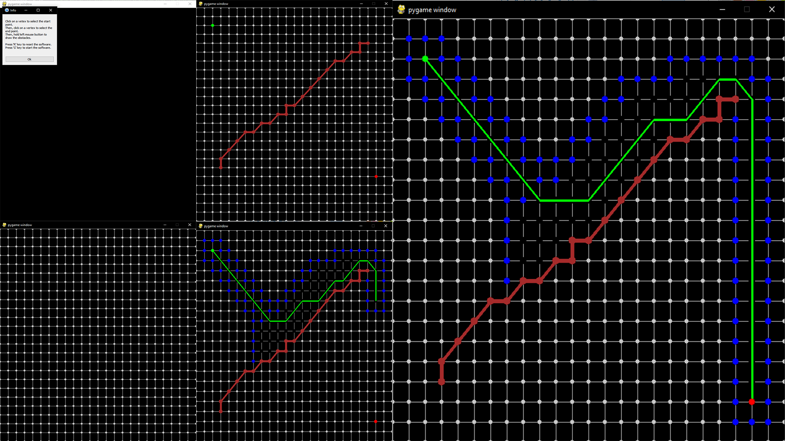

# AStarPathFidingAlgorithm

A star pathfinding algorithm is an efficient pathfinding algorithm which naviagets by calculating heuristics. On each iteration, the point closest to the goal is reached.
This code is an attempt to computerize the pathfinding algorithm. You can select a start point, end point and the obstacles which the path can not touch.

The image shows the various states of the software. Green dot is the start, red dot is the end, green lines are the path, blue dots are open points and black points are closed points.

## Installation

1. Clone the repository in a desired folder
2. Open "AStarPathfindingAlgorithm/" which is the direcotry with setup.py file
3. Enter "cmd" in the directory bar
4. Enter "Python setup.py develop"
5. Run the main.py script

If you are unable to develop setup.py file, manually install pygames and PySide2 using:
'pip install pygames'
'pip install PySide2'

## Instructions

Run the code to display a popup with instructions on how to use the software.

## Comments

The code is a functional implementation of A* pathfinindg algorithm. For most cases the path found is the most efficient paths. A bug currently causes the software to sometimes take an inefficient step.
